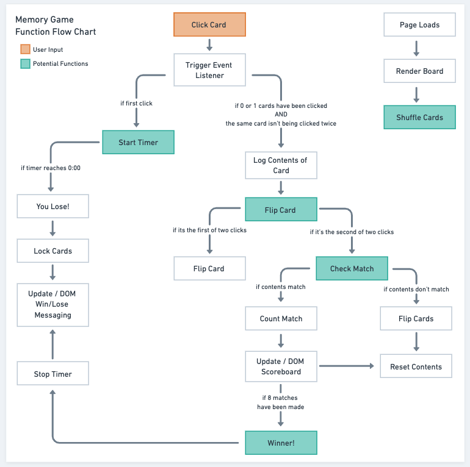

# Project 1: Ocean Memory Game

## Description:
A simple, ocean-themed memory game built for my first General Assembly Software Engineering Immersive project.

## Technical Requirements
1. Render game in browser
2. Include win/loss logic and render win/loss messages in HTML
3. Include separate HTML, CSS, and JavaScript files
4. Use vanilla JavaScript or jQuery
5. All code should be properly indented and formatted
6. No remaining dead or commented out code
7. Code in a consistent manner
8. Project should be deployed online using gitHub

## Technologies Used: 
* HTML
* CSS
* JavaScript
* GitHub Branching

## Getting Started: 

* [Link to game](https://ocean-memory-game.netlify.app)

* Instructions: Click on a card to flip it over. Each card has a double somewhere else on the board - try to find it! To win, you must find all of the matches within the time limit. Keep in mind, you can only flip over two cards at a time!

## Next steps: 

* [Expansion!](https://github.com/emilyaikens/Project-1-Extension) Create an option to play on a larger board (6x6)
* Themes! Allow user to select different themes for the game eg. space cats, botanical, robots etc.

## Game Screenshots:
Below: Initialize

Below: Mid-game

Below: Win screen

## Project Hurdles
* Finding a method to "flip" a card over was my first big hurdle. I considered creating HTML elements that could be hidden and revealed, or buttons that lost and gained their transparency, but it all seemed sloppy to me. Eventually I stumbled across css transform and background-visibility properties and they seemed like the perfect tool. I spent time really trying to understand the functionality of these properties so that I could not only use them, but also manipulate them throughout the game.

* The second hurdle I came across was creating the checkMatch function. The concept was simple enough - check if a match exists, if yes, change some DOM elements, log match, clear the current player choices (stored in the curCards array) and flip the cards back over. The card flip was set to occur after a couple of seconds via a setTimeout function that chose the cards based on the contents of the curCards array. I couldn't get the cards to flip back! I singled out the timer logic and determined that it was, in fact working, so it must have to do with the array. At that point I realized that the array was clearing before the "timer" went off. I set the array to clear a millisecond after the card flip timer went off, and the problem was solved. 

* Throughout the project I wrestled with how best to organize my code. I am clean and organized in most aspects of my life, this certainly will not be an exception. The problem is, the world of coding is new enough to me that I don't completely know what "clean and organized" looks like. On the other hand, even as a novice I know when I see a messy disaster. I found that revisiting my pseudocode and creating a flow chart (see below) helped me organize my ideas. From there it was easier to write my code in a more organized way. This, in turn, made it more accessible for later debugging and adjustments. 

## Other sources: 

* [Psuedocode Google Sheets Link](https://docs.google.com/document/d/1LdG4PHq_HRYHKUmoWMRiXVa6-AjTFsh6L7WUj7Yd5FE/edit?usp=sharing)

* [Wireframe: Start Scenario](https://whimsical.com/memory-game-start-RpodFpFb3HcZQUX6fLgCmm)

* [Wireframe: Win Scenario](https://whimsical.com/memory-game-win-JKjhm2bYTJAuGcc92UrdqZ)

* [Wireframe: Lose Scenario](https://whimsical.com/memory-game-loss-WdfemVQmZnRXTf9fUevtpc)

* [Wireframe: Functions Flow Chart](https://whimsical.com/BZJpjzvMjzVhn7sShnXn3b)

* Image credit: me! I drew them. 
