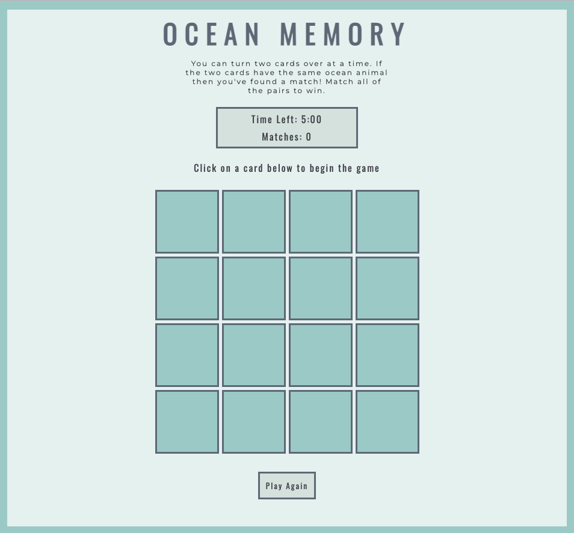
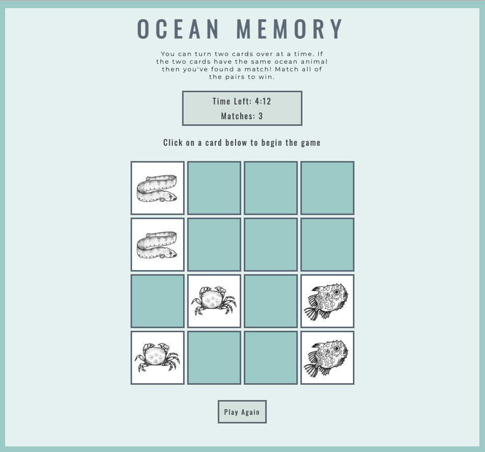
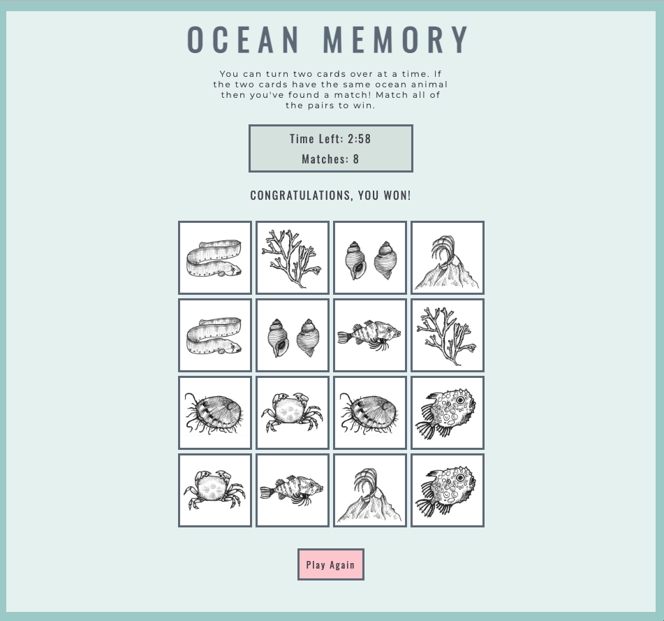

Project 1: Ocean Memory Game

Description:
    A simple ocean-themed memory game built for my first General Assembly Software Engineering Immersive project.

Technologies Used: 

    - HTML

    - CSS

    - JavaScript

Getting Started: 

    - Link to game: 

    - Instructions: Click on a card to flip it over. Each card has a double somewhere else on the board - try to find it! To win, you must find all of the matches within the time limit. Keep in mind, you can only flip over two cards at a time!

Next steps: 

    - Expansion! Create an option to play on a larger board (6x6). 

Other sources: 

    Psuedocode Google Sheets Link:

    https://docs.google.com/document/d/1LdG4PHq_HRYHKUmoWMRiXVa6-AjTFsh6L7WUj7Yd5FE/edit?usp=sharing

    Wireframe: Start Scenario

    https://whimsical.com/memory-game-start-RpodFpFb3HcZQUX6fLgCmm

    Wireframe: Win Scenario

    https://whimsical.com/memory-game-win-JKjhm2bYTJAuGcc92UrdqZ

    Wireframe: Lose Scenario

    https://whimsical.com/memory-game-loss-WdfemVQmZnRXTf9fUevtpc